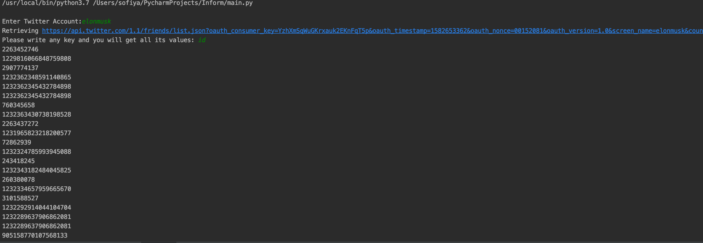
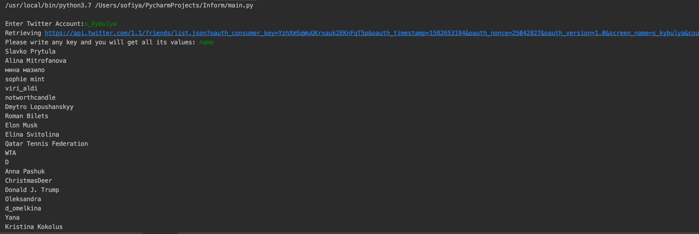

**Parsing json and getting needed values**

After receiving Twitter API this module parses json file. User enters username and then he can enter any key to get needed values. Soon all values will be shown.

**Results of launching**

**Conclusion**

Using this module you can easily get needed information about username's friends by entering key.